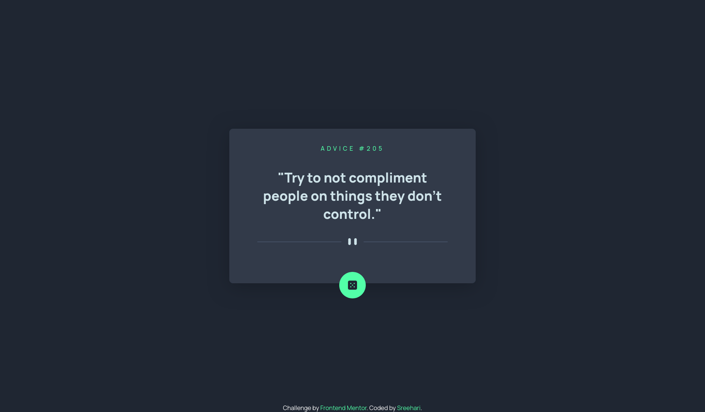
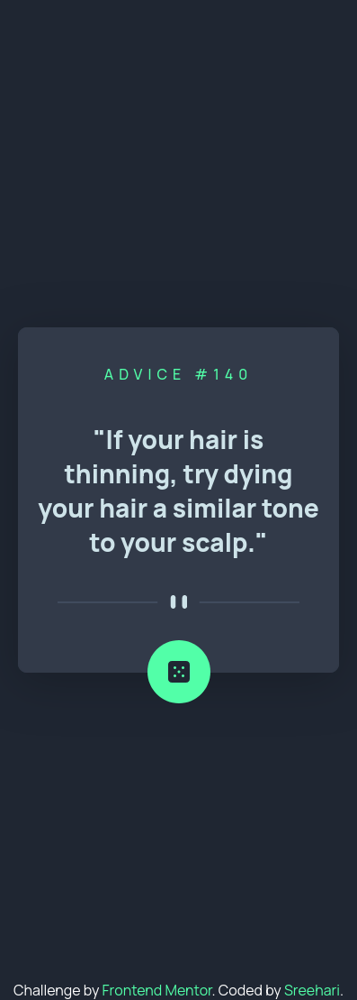

# Frontend Mentor - Advice generator app solution

This is a solution to the [Advice generator app challenge on Frontend Mentor](https://www.frontendmentor.io/challenges/advice-generator-app-QdUG-13db). Frontend Mentor challenges help you improve your coding skills by building realistic projects.

## Table of contents

- [Overview](#overview)
  - [The challenge](#the-challenge)
  - [Screenshot](#screenshot)
  - [Links](#links)
- [My process](#my-process)
  - [Built with](#built-with)
  - [What I learned](#what-i-learned)
- [Author](#author)

## Overview

### The challenge

Users should be able to:

- View the optimal layout for the app depending on their device's screen size
- See hover states for all interactive elements on the page
- Generate a new piece of advice by clicking the dice icon

### Screenshot

     Desktop View



    Mobile View



### Links

- Solution URL: Click [Here](https://github.com/sreehariv-code/advice-generator-app-main)
- Live Site URL: Click [Here](https://sreehariv-code.github.io/advice-generator-app-main/)

## My process

### Built with

- Semantic HTML5 markup
- CSS custom properties
- Flexbox
- CSS Grid

### What I learned

Using this challenge I was able to recap over some of the basic concepts of DOM Manipulation and event listeners. This was a great challenge to understand API integration using vanilla JS.

I have learned how to implement the glow effect on hovering the dice button using pseudo elements and css filter properties. Here is a small interpretation of the effect.

```html
    //index.html
    <button class="random-btn>
        
    </button>
```

```css
/*style.css*/
.random-btn {
  background: var(--primary-neon);
  width: 70px;
  aspect-ratio: 1/1;
  transform: translateY(80%);
  border-radius: 50%;
  display: grid;
  place-items: center;
  position: relative;
  isolation: isolate;
  z-index: 0;
}

.random-btn::before {
  content: "";
  position: absolute;
  inset: 0;
  width: 100%;
  height: 100%;
  background: var(--primary-neon);
  transition: 0.5s ease;
  z-index: -1;
  border-radius: inherit;
  filter: blur(10px);
  opacity: 0;
}

.random-btn:hover::before {
  opacity: 1;
}
```

## Author

- Frontend Mentor - [@sreehariv-code](https://www.frontendmentor.io/profile/sreehariv-code)
- Github - [@sreehariv-code](https://github.com/sreehariv-code)
